# License Plate Reader

Authors: **Joanna Dagil** and **Maja Szerszen**

(readme file generated based on presentation in polish in subfolder `latex`)

This project focuses on automatically reading a vehicle license plate number
from a photograph. The solution uses a two-stage YOLO11 pipeline: first the plate is detected in the full image, then
individual characters are recognized from the cropped plate.

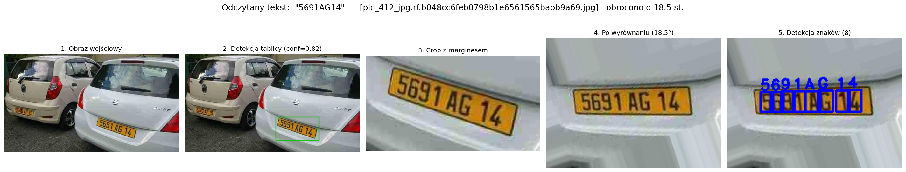


## Summary

The goal of the project is to automatically **read the license plate number**
from a vehicle photograph.

The solution uses a **two-stage approach**:

1. license plate detection in the full image,
2. recognition of individual characters on the cropped plate.

Both stages are based on `YOLO11` models from Ultralytics. The system was trained
and executed in cloud environments: Kaggle / Colab with a Tesla T4 GPU.

The key idea is to strengthen the character detector with:

- **synthetic data** generated with automatic bounding boxes,
- **pseudo-labeling** of real plate crops.

Main results:

| Component | Result |
|---|---:|
| Plate detection | `mAP@0.5 = 0.97` |
| Full plate reading | `exact match ~= 59%` |
| Character-level error | `CER ~= 0.17` |

## Introduction

**Automatic Number Plate Recognition** (ANPR) is commonly used in:

- parking systems,
- access control,
- road tolling,
- traffic monitoring.

The task is difficult because real images may contain:

- different angles, perspective, and plate curvature,
- changing lighting conditions and low resolution,
- blur, noise, and compression artifacts,
- visually similar characters, for example `O` / `0`, `Q` / `O`, `8` / `B`.

This project checks whether lightweight one-stage detection models combined with
synthetic data can form an effective license plate reading pipeline.

## Project Context and Goal

The goal is to build a system that receives a vehicle photograph and returns the
character string corresponding to the license plate.

Detailed goals:

- train a license plate location detector (`YOLO11n`),
- train a 36-class character detector for digits `0-9` and letters `A-Z`,
- solve the problem of limited labeled character data with synthetic data and
  pseudo-labeling,
- evaluate detection metrics and text-reading quality using exact match and CER.

## Literature

- Barkat Ali Arbab, *License Plate Detection Dataset (10,125 Images)*, Kaggle.
- Francesco Pettini, *License Plate Characters Detection OCR*, Kaggle.
- Nick Yazdani, *License Plate Text Recognition Dataset*, Kaggle.
- Khanam, R. and Hussain, M. (2024), *YOLOv11: An Overview of the Key
  Architectural Enhancements*, arXiv:2410.17725.
- Jocher, G. and Qiu, J. (2024), *Ultralytics YOLO11*, GitHub.
- Laroca et al. (2018), *A Robust Real-Time Automatic License Plate Recognition
  Based on the YOLO Detector*, IJCNN.
- Tourani et al. (2020), *A Robust Deep Learning Approach for Automatic Iranian
  Vehicle License Plate Detection and Recognition for Surveillance Systems*,
  IEEE Access.

## Data Description

The project uses three external datasets, generated synthetic data, and a
manually labeled sample for OCR quality evaluation.

### 1. License Plate Detection Dataset

The first dataset, *License Plate Detection Dataset (10,125 Images)*, contains
vehicle images with license plate location annotations.

It is used for **license plate detection** in the full image. It does not contain
the actual text written on the plates.

- YOLO-compatible annotation format,
- one class: `License_Plate`,
- split into `train` / `valid` / `test`,
- validation set: 2048 images,
- test set: 1020 images.

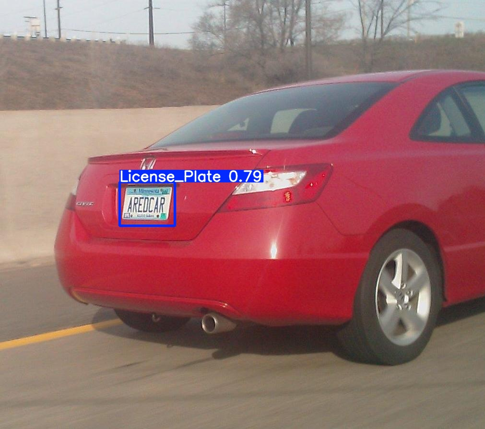

YOLO label format:

```text
class x_center y_center width height
0     0.512    0.781    0.154 0.067
```

The values `x_center`, `y_center`, `width`, and `height` are normalized to the
image size, so they are between 0 and 1.

### 2. License Plate Characters - Detection OCR

The second dataset, *License Plate Characters - Detection OCR*, contains about
200 real license plate crops and about 2000 labeled characters.

It is used as:

- the real labeled base dataset for character detection,
- the validation and test source for the character detector.

Character labels are classes `0-35`, corresponding to digits `0-9` and letters
`A-Z`.


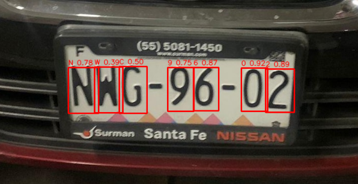

Problem: the real character dataset is small, so a 36-class detector trained
only on this data performs poorly.

### 3. Synthetic License Plate Crops

To increase the amount of training data **without manual labeling**, a synthetic
license plate generator was built.

The generator renders a plate character by character, so it knows the exact
coordinates of every character. This means bounding boxes are created
automatically.

Generation order:

1. render a clean plate and character boxes,
2. apply geometric transformations: perspective and rotation,
3. apply photometric degradations: blur, noise, low resolution, JPEG artifacts.

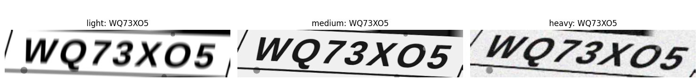

The project generated **12,000 images** with YOLO labels. About 30% of them are
two-line plates.

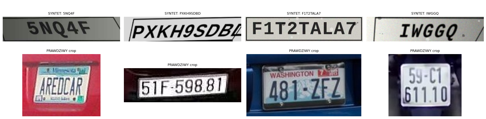

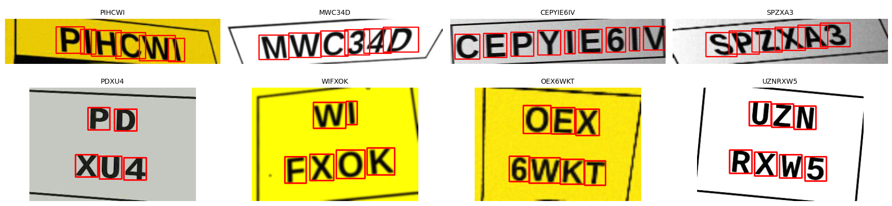

Synthetic images are used only for training. Validation and test data remain
100% real.

### 4. License Plate Text Recognition Dataset

The third dataset, *License Plate Text Recognition Dataset*, contains thousands
of real plate crops with text labels, but without character bounding boxes.

It is used for pseudo-labeling.

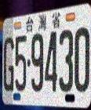

Example text label:

```text
G59430
```

### 5. Manual Ground Truth

To measure full-plate reading quality, the project uses a manually checked
sample stored in `manual_ocr_ground_truth.csv`.

The file contains:

- 177 examples,
- crop name,
- crop path,
- text predicted by the OCR pipeline,
- manually verified true plate text.

This sample is used to calculate:

- exact match,
- similarity,
- CER, or Character Error Rate.

## Methods

The project uses a two-stage approach because license plate reading consists of
two tasks:

- **license plate detection**: finding where the plate is located in the image,
- **text recognition**: reading characters from the cropped plate region.

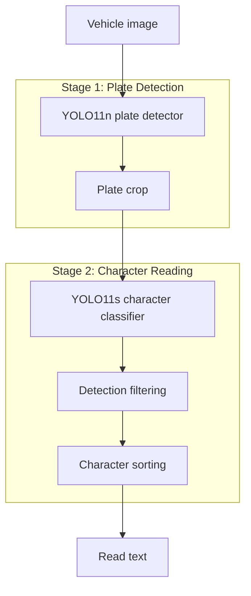

### Stage 1: Plate Detection (`YOLO11n`)

The plate location detector uses `YOLO11n` from Ultralytics.

- YOLO is a one-stage object detection model.
- The model is trained on one class: `License_Plate`.
- It returns bounding boxes and confidence scores.
- The `YOLO11n` variant was selected because it is lightweight and fast.

Training configuration:

| Parameter | Value |
|---|---|
| Starting model | `yolo11n.pt` |
| Epochs | 30 |
| `imgsz` | 640 |
| `batch` | 16 |
| `patience` | 10 |
| Output weights | `plate_detector_best.pt` |

### Plate Crop With Margin

After YOLO detects the plate, the predicted bounding box is cropped from the
image.

- The crop limits the next processing steps to the plate area.
- Raw YOLO crops are very tight, so characters may touch the crop border.
- Therefore, the plate is cropped again with an approximately 12% margin.
- Each crop is also deskewed using the angle estimated from the character line.
- Earlier contour-based perspective rectification was rejected because it often
  damaged good crops and did not fix curved plates.

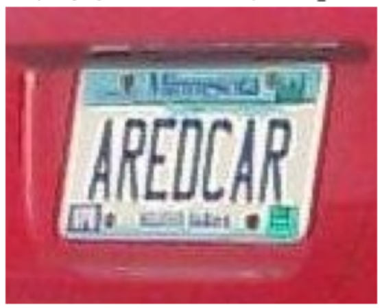

### Stage 2: Character Detection (`Char-YOLO`)

The second model detects and classifies individual characters on the cropped
license plate.

- Model: `YOLO11s`.
- Number of classes: 36.
- Classes: digits `0-9` and letters `A-Z`.
- Higher input resolution: `imgsz = 480`.
- After detection, filtering and character sorting are applied.
- Two-line plates are handled by reading the upper row first, then the lower row.

### Synthetic License Plate Generator

Synthetic data addresses the limited number of manually labeled real characters.
Because the generator creates the plate itself, it can automatically produce
bounding boxes for every character.

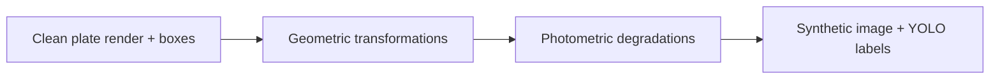

### Pseudo-Labeling

Pseudo-labeling uses the third dataset, which has text labels but no character
bounding boxes.

Procedure:

1. Run the freshly trained `Char-YOLO` model on real plate crops.
2. Convert detections to a text string.
3. Compare the predicted string with the known text label.
4. Keep only samples where the full string matches exactly.
5. Reuse the predicted boxes as new training labels.

Confidence threshold:

```text
conf = 0.50
```

The text match works as an automatic quality filter: wrong detections usually
produce wrong text, so the sample is rejected.

## Implementation

The notebook automatically detects the runtime environment:

- Kaggle,
- Colab,
- local execution.

It then sets dataset paths and result paths. Training was performed on a
**Tesla T4** GPU using Ultralytics 8.4, PyTorch, and CUDA.

Pipeline organization:

- Stage 1 and Stage 2 are trained independently.
- Weights are saved as `plate_detector_best.pt` and `char_yolo_best.pt`.
- Training can be skipped by loading prepared model weights.
- Both models are packed into one archive: `oba_modele_yolo.zip`.

Text postprocessing:

- convert to uppercase,
- remove spaces and special characters,
- keep only `[A-Z0-9]`.

Example:

```text
"PCZ DSq8" -> "PCZDSQ8"
```

## Results

### Qualitative Examples


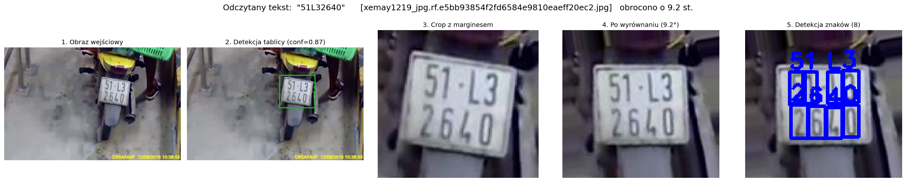

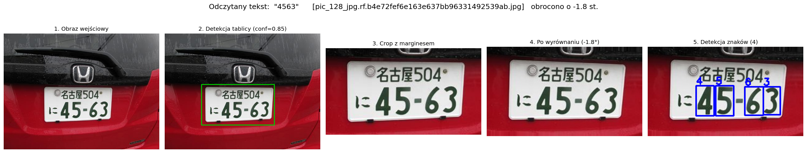

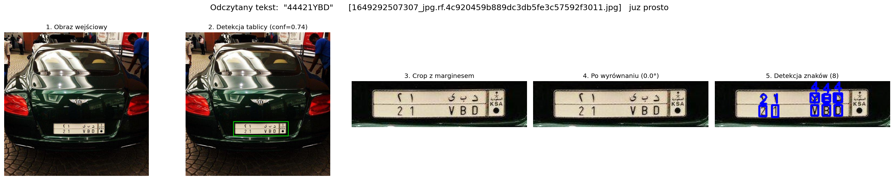

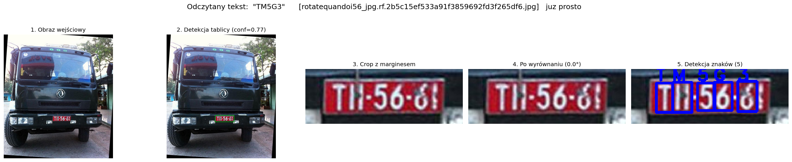

### Plate Detection Results (`YOLO11n`)

Metrics for one-class plate detection:

| Dataset | Precision | Recall | mAP@0.5 | mAP@0.5:0.95 |
|---|---:|---:|---:|---:|
| Validation | 0.983 | 0.948 | 0.970 | 0.686 |
| Test | 0.990 | 0.949 | 0.972 | 0.692 |

Observations:

- plate detection is highly effective,
- `mAP@0.5 ~= 0.97`,
- lower `mAP@0.5:0.95` is caused by stricter IoU thresholds,
- localization precision is sufficient for cropping.

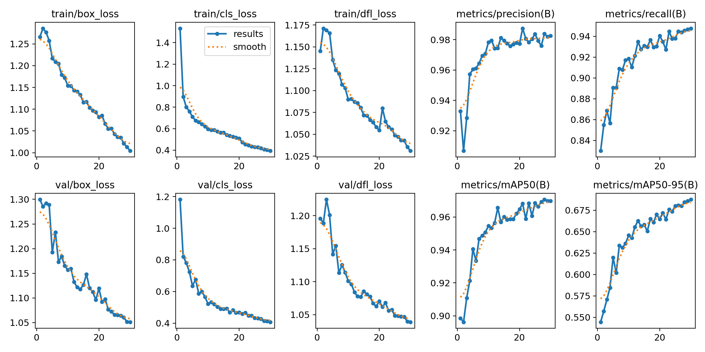

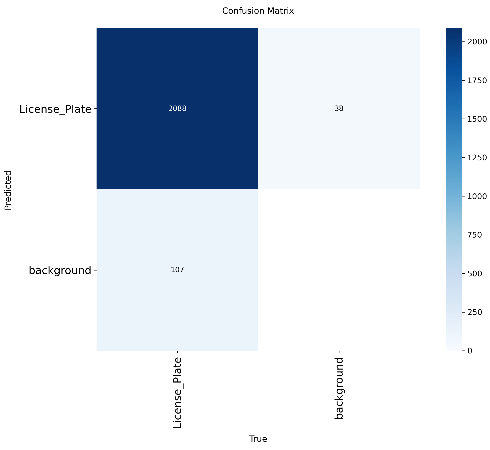

### Character Detection Results (`Char-YOLO`)

Metrics for 36-class character detection. Validation and test data are 100%
real.

| Dataset | Precision | Recall | mAP@0.5 | mAP@0.5:0.95 |
|---|---:|---:|---:|---:|
| Validation | 0.850 | 0.758 | 0.812 | 0.588 |
| Test | 0.930 | 0.888 | 0.963 | 0.693 |

Observations:

- synthetic data and pseudo-labeling made it possible to train a 36-class
  detector,
- the most difficult symbols are visually similar characters: `O` / `0`, `Q`,
  `X`, `8` / `B`.

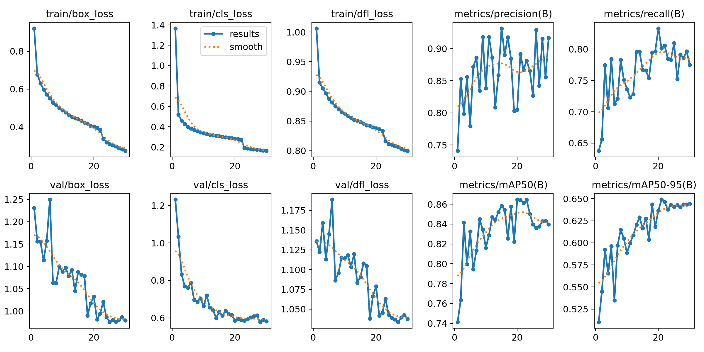

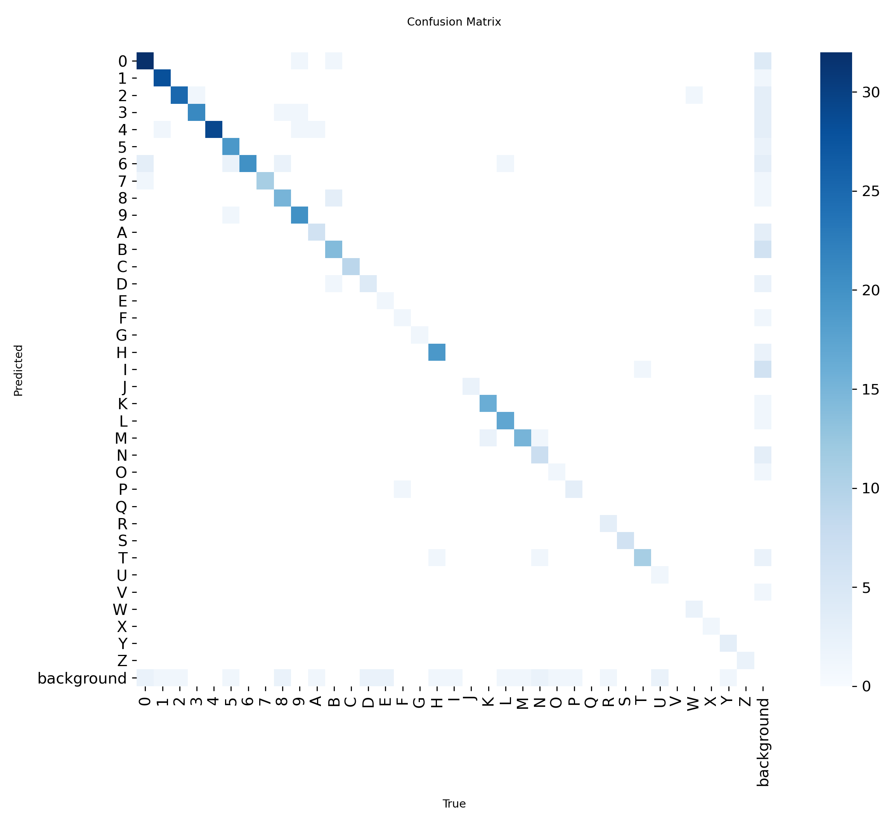

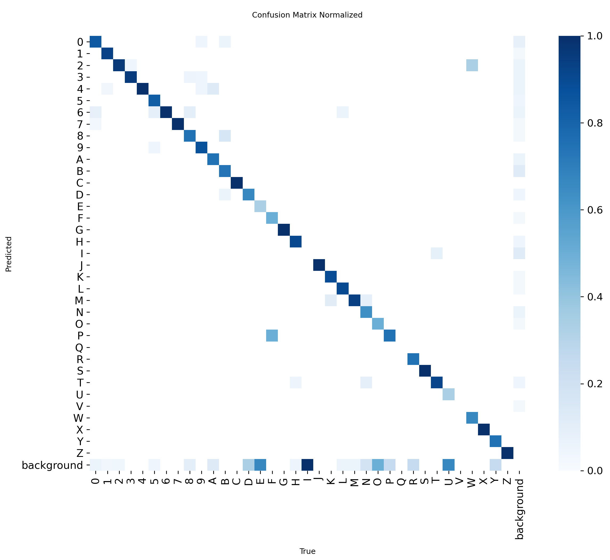

### Full Plate Text Reading Results

Text evaluation was performed on a manually labeled sample of 177 examples.

| Metric | Value |
|---|---:|
| Exact match, full plate correct | 0.590 |
| Similarity, string similarity | 0.850 |
| CER, Character Error Rate | 0.175 |

Interpretation:

- about 59% of plates are read fully correctly,
- CER shows that errors usually affect individual characters,
- high similarity means incorrect predictions are usually close to the true
  plate number.

```text
CER = edit distance / ground truth length
```

Lower CER is better.

## Conclusions

- A two-stage `YOLO11` pipeline can effectively read license plates.
- Plate detection is the strongest part of the system: `mAP@0.5 ~= 0.97`.
- Synthetic data is crucial because real labeled character data is limited.
- Pseudo-labeling adds more data without manually labeling character boxes.
- Character reading remains the bottleneck: one wrong character lowers the exact
  match score for the whole plate.

## Project Files

```text
license-plate-reader/
|-- license-plate-project.ipynb
|-- manual_ocr_ground_truth.csv
|-- oba_modele_yolo.zip
|-- README.md
|-- READMEv2.md
`-- latex/
    |-- license-plate-reader.tex
    |-- references.bib
    `-- pics/
```

The archive `oba_modele_yolo.zip` contains:

```text
plate_detector_best.pt
char_yolo_best.pt
```

## How to Run

Main project notebook:

```text
license-plate-project.ipynb
```

The notebook includes training, inference, crop generation, pseudo-labeling,
text evaluation, and model packaging.
